# Visualize customer insights with business data for product performance analysis

To visualize existing business data and analyze the performcance of the products, companies needs and easy tool that can ingest huge amount of data from different sources like CSV files or a connection to data warehouses and create visulaization through different form of charts. These charts helps businesses analyze the performances of different products in the company and make actionable decisions to improve their performances. IBM Cognos Analytics, a business intelligence solution empowers users with AI-infused self-service capabilities that accelerate data preparation, analysis, and report creation. Cognos makes it easier than ever to visualize data and share actionable insights across your organization to foster more data-driven decisions. This code pattern shows how you can visualize business data in Cognos Analytics for product performance analysis.

In this code pattern, we will walk you through the process of creating sales, store and inventory data to support our coffee company products. The data will be uploaded into a Db2 Warehouse schema which will then be connected to Cognos Analytics. We will created additional Cognos Analytics dashboards to visualize the business data.

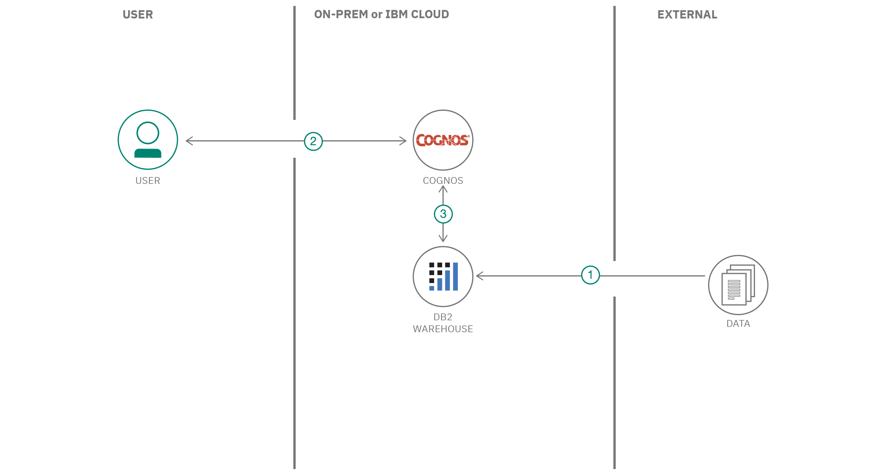

## Flow

1. Product and business data is loaded into Db2 Warehouse tables.
2. User runs Cognos Analytics.
3. Cognos Analytics is linked to the Db2 Warehouse instance. The data can then be used to build visualizations on Cognos Analytics dashboards.

## Steps

1. [Create IBM Db2 Warehouse service on IBM Cloud](#1-create-ibm-db2-warehouse-service-on-ibm-cloud)
1. [Add Db2 service credentials to environment file](#2-add-db2-service-credentials-to-environment-file)
1. [Run scripts to load data into the database](#3-run-scripts-to-load-data-into-the-database)
1. [Create database connection in Cognos Analytics](#4-create-database-connection-in-cognos-analytics)
1. [Load metadata from the connected database](#5-load-metadata-from-the-connected-database)
1. [Build a Data Module in Cognos Analytics](#6-build-a-data-module-in-cognos-analytics)
1. [Create a Cognos Analytics dashboard](#7-create-a-cognos-analytics-dashboard)
1. [Add visualizations to the dashboard](#8-add-visualizations-to-the-dashboard)


## 1. Create IBM Db2 Warehouse service on IBM Cloud

Create the IBM Db2 Warehouse on Cloud service and make sure to note the credentials using the following link:

* [**IBM Db2 Warehouse on Cloud**](https://cloud.ibm.com/catalog/services/db2-warehouse)

## 2. Add Db2 service credentials to environment file

Using the same `.env` file you created in the previous section, change the value of `DB2wh_DSN` as shown below:

```bash
DB2WH_DSN=<value of ssldsn>
```

The value can be copied from the `Service credentials` panel of your Db2 Wareshouse service.

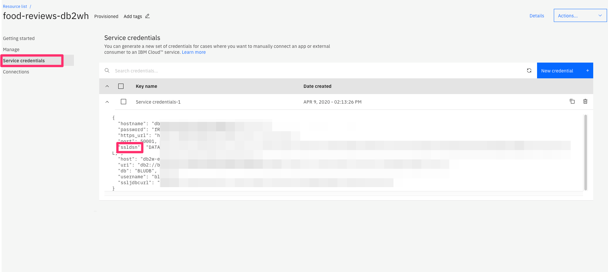

## 3. Run the script to load data into the database

From the command prompt, go to the `lib/db` folder in your project directory and run the script to load business data into your IBM Db2 Warehouse service:

```bash
cd lib/db/
node save-product-reviews.js
```

This will create the schema, assign relationships, and load the product and sales data into the database.

>NOTE: product reviews are loaded to IBM Db2 Warehouse from CSV files. These csv files contains each product reviews and their sentiments that are generated from discovery service. To learn more about it go to this [code pattern](https://github.com/IBM/cognos-analytics-using-unstructured-data)

## 4. Create database connection in Cognos Analytics

* From the Cognos Analytics main dashboard, select `Manage` from the lower left corner  and click `Data Server Connections`.

* Click the `+` icon to add a new connection.

* Select `IBM Db2 Warehouse` from the list.

* Copy the `ssljdbcurl` value from the Db2 Warehouse service credentials that you have saved earlier, and paste that into the `JDBC URL` field.

* Add username/password credentials by selecting `Use the following sign on`.

* Click the `+` icon to add a new `sign on`.

* Enter the username and password from your Db2 Warehouse service credentials.

* Click the `Test` link to make sure the connection is successful.

* Give a unique name to your connection and click `Save`.

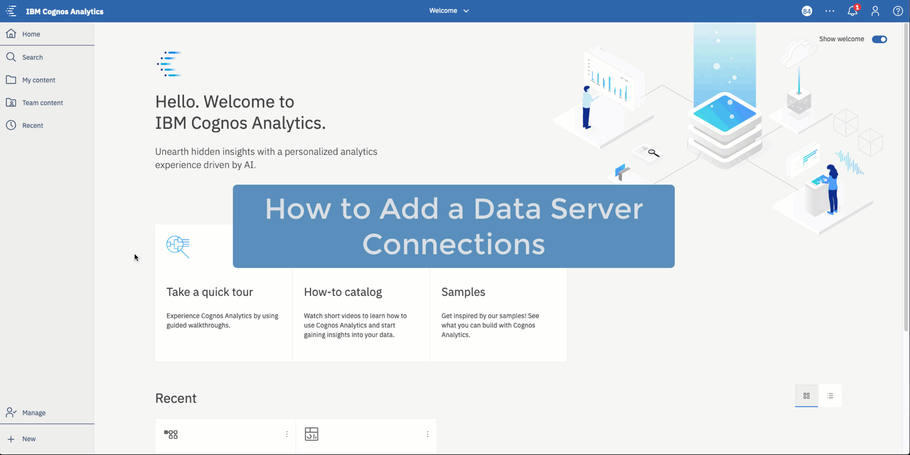

## 5. Load metadata from the connected Database

Once the connection is successful, you will need to load the metadata from the database. This will include tables, relationships and data.

Select `Schemas` from the tab menu, and then select the schema `DB2INST1` from the list. Click the three dots on the right and then click `Load metadata`.


## 6. Build a Data Module in Cognos Analytics

* From the Cognos Analytics main dashboard, select the `+` icon in the lower left corner. Select `Data Module`.

* From the source selection panel, select the data connection and metadata that you created in the previous steps. Then click `OK`.

* Click `Select Tables` in the next dialog and click `Next`. You will see all the tables and data loaded in the left navigation bar.

* Select all of the tables in the next screen and click `OK`.

* Click the `Save` icon in the top menu to save off the `Data Module`.

* From the data module panel, click on the `Relationships` tab to see that all of the relationships defined in the Db2 Warehouse database have been replicated.

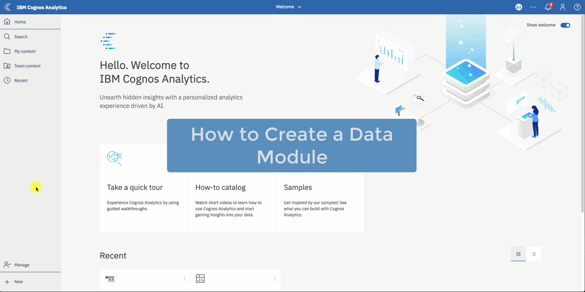

## 7. Create a Cognos Analytics dashboard

From the current data module panel, select the `+` icon in the lower left corner. Select `Dashboard`.

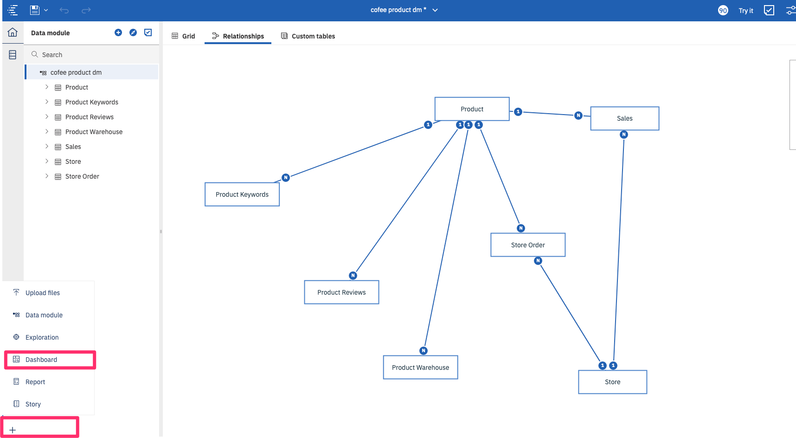

Select the dashboard template or any other template that fits your need. We are going to select the default template, which contains one large drawing area.


>**Note**: In this section we will be creating a new `Dashboard` that is associated with our new `Data Module`. This will mean that this dashboard is not connected to the dashboard we created in the previous section of this code pattern. It is, however, possible to have multiple data modules (in our example, one for our `csv` files and one for our Db2 Warehouse connection) associated with the same dashboard. If you would like to do that, connect the Db2 Warehouse data module to the dashboard you created in the previous section, and simply create a new dashboard tab to hold the new visualizations we will be creating in the following steps.

## 8. Add visualizations to the dashboard

In this section we will create visualizations using the schema and data loaded from our IBM Db2 Warehouse database.

### Store locations map with sales data

From the visualization list, select `Map` and drag it onto the canvas.

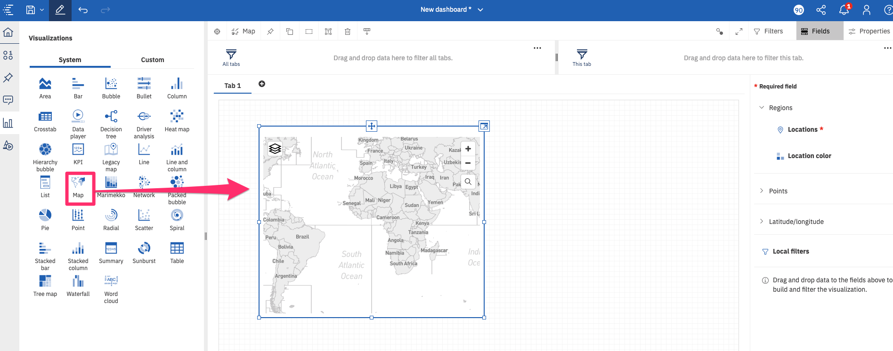

With the `Map` visualization object selected, click `Fields` from the top menu.

Select `Store -> Lat` from the resource list and drag and drop it onto the `Latitude` label [1] in the field list. Do the same for `Store -> Long` and drop onto the `Longitude` label [2].

In order to show the total sales of each store in the map, select `Sales -> Amount` and drag and drop it onto both the `Point size` [3] and `Point color` [4] labels in the field list. This will correlate the size of the store object with the amount of sales the store has (i.e. the higher the sales, the larger the store will be represented).


To change the style of the map, select `Properties` from the top menu, then click on `Chart` to expand it. Change the `Style` value to experiment with different map backgrounds.

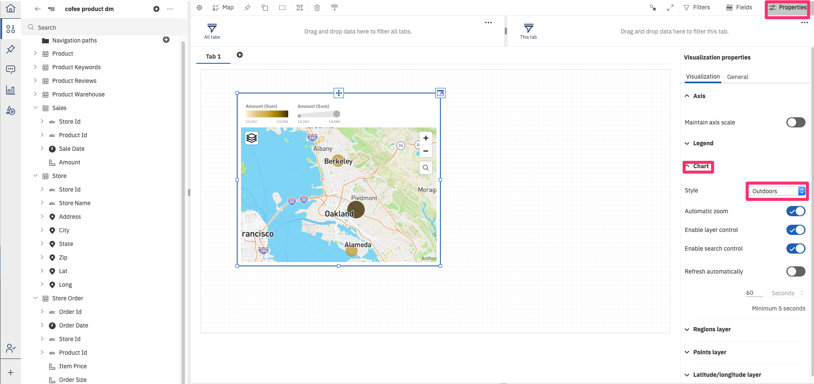

You can also change the point color range by [NEEDS UPDATE]

Use the `Title` icon to change the title of our visualization object to `Store Location` [1].

You can also change the name of the dashboard tab by selecting the tab and editing the text [2].

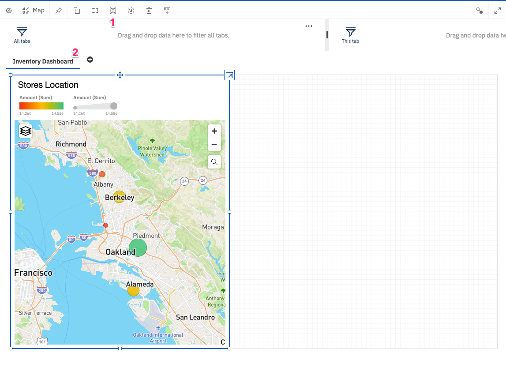

### Sales by store

Next we want to show the amount of sales for each of our stores. For this we will use a `Column` visualzation object.

* Select `Store -> Store Name`, `Sales -> Sale Date`, and `Sales -> Amount` from the resource list and drag and drop them onto the canvas.

* Use the default visualization object, which is a `Column` chart.

* To make working with the visualization easier, you can maximize it by clicking on the maximize button.

* The default axis label is the name of the data module field. To change it, click `Properties` from the top menu. Select `Axis` and enter a name `Months` in `Item axis title`.

* Change the title to `Sales By Store`.

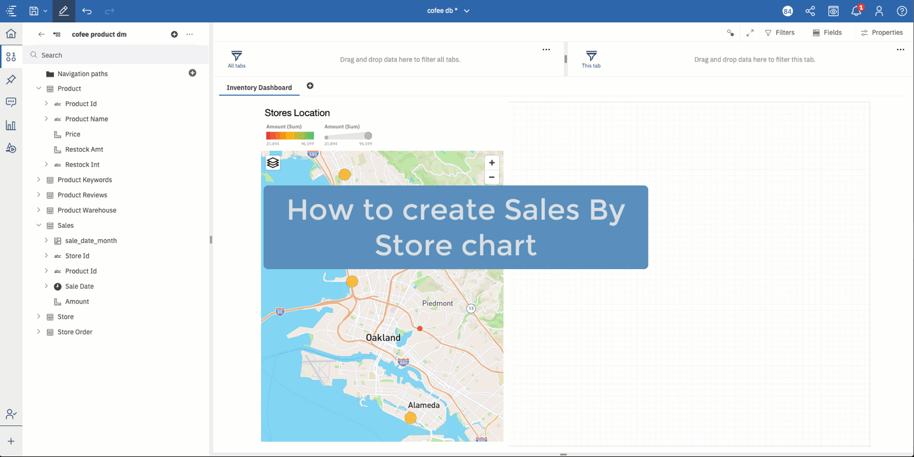

### Product monthly inventory

Next we want to show the monthly inventory amounts for each of our products.

Select `Product -> Product Name`, `Product Warehouse -> Item Stock Date` and `Product Warehouse -> Quanity` from the resource list and drag and drop them onto the canvas.

Keep the default visualization object, which is a `Line` graph.

>**Note**: One of the key features of Cognos Analytics is forecasting. In this chart we can click on the `Forecasting` icon to predict inventory amount for the next several months - which will be shown with dotted lines. The icon is located in the top righ corner of the visualization object.

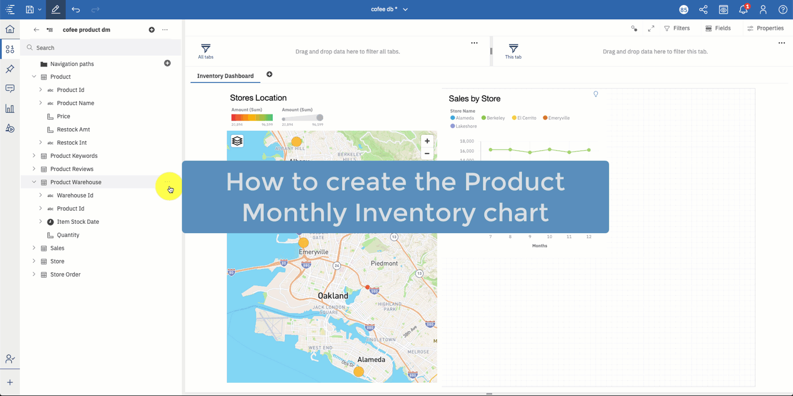

### Product Monthly Sales

Our last visualization will be to show the montly sales amount for each of our products. This will help provide insight into how much product inventory to carry.

First we will need to create a calculation that will generate a `month` value from the `Sale Date`. This way we can show monthy sales totals for each product.

To create the calculation:

* Right-click on the `Sales` table in the resource list and select `Calculation` to bring up the calculation panel.

* In the expression text box, use the `_month` function. To set the function parameter, drag and drop `SALE_DATE` inside the function parenthesis.

* Name the calculation `sale_date_month`.

* Hit the `eye` icon to run the function and view the output.

* Click OK to save the calculation.

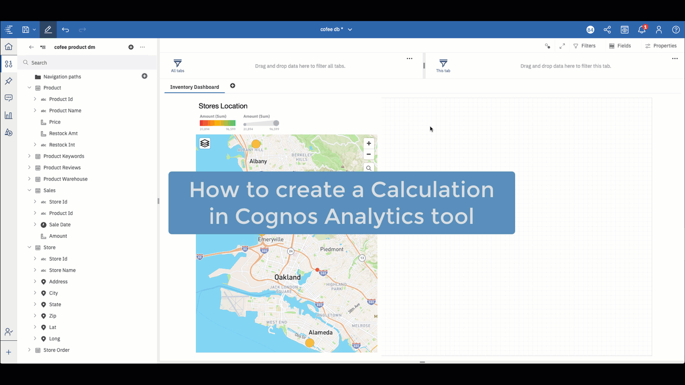

Now that we have our new calculation field, let create our `Product Montly Sales` chart.

* Select `Product -> Product Name`, `Sales -> Sale Date`, and `Sales -> Amount` from the resource list and drag and drop them onto the canvas.

* The default chart will show daily sales amounts. To change the value to monthly sales:

  * Click `Fields` from the top menu.
  * Replace the `x-axis` field by drag and dropping the `sales_date_month` calculation onto the `x-axis` field. This will replace the original field used, which was `Sale Date`.

* Click `Properties` from the top menu.

* To show sales values in the chart, click on `Chart` and click `Show value labels`.

* To rename the axis label, click on `Axis` and rename the `Item axis title` to `Months`.

* Change the title to `Product Monthly Sales`.

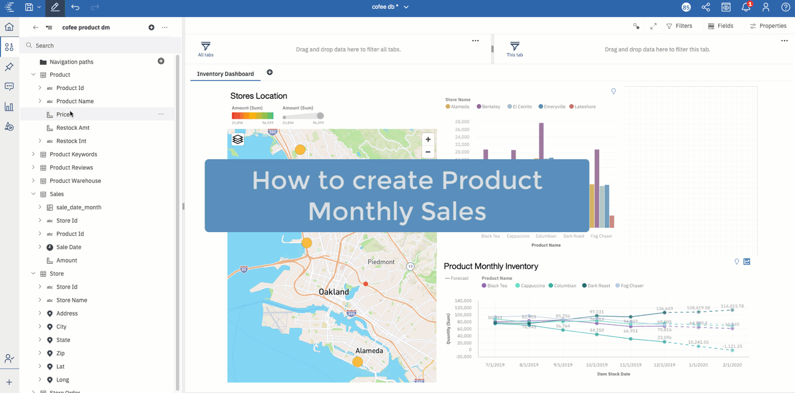

### Complete and Save

Once complete, the dashboard should look similar to this:

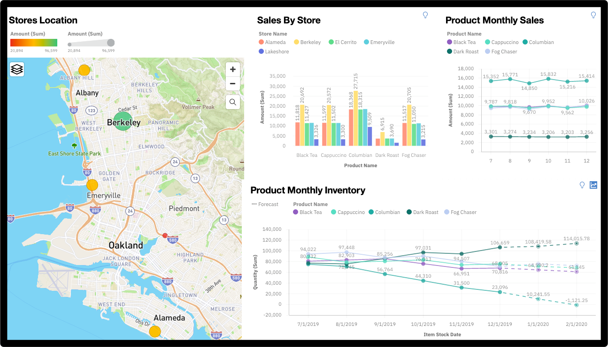

Click the `Save` icon in the top menu to save your dashboard.

#### Dashboard navigation

Just like the dashboard we created in the first section, now that all of your visualizations are defined and linked correctly, you can manipulate the dashboard using your mouse. If you click on a product or store name in any of the visualization objects, the entire dashboard will change to reflect that specific product or store.

**Congratulations!** You should now know how to navigate your way through setting up and creating data modules and dashboards in Cognos Analytics. You should also understand how to integrate with multiple data sources using Watson Discovery and IBM Db2 Warehouse.

# License

This code pattern is licensed under the Apache Software License, Version 2.  Separate third party code objects invoked within this code pattern are licensed by their respective providers pursuant to their own separate licenses. Contributions are subject to the [Developer Certificate of Origin, Version 1.1 (DCO)](https://developercertificate.org/) and the [Apache Software License, Version 2](https://www.apache.org/licenses/LICENSE-2.0.txt).

[Apache Software License (ASL) FAQ](https://www.apache.org/foundation/license-faq.html#WhatDoesItMEAN)

